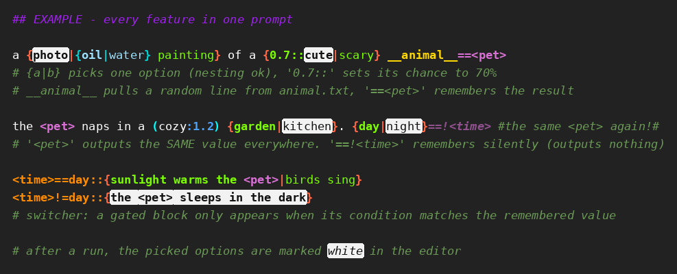

# ValiTools

A collection of ComfyUI custom nodes. More tools will be added over time.

## Nodes

### VSmartPrompt

A Dynamic Prompts node with a rich-text (syntax-highlighted) prompt editor.

- **Combinations**: `{a|b}` with optional `N::` weights, nested at will, per-level coloring
- **Wildcards**: `__file__` pulls a random line from a `.txt` in `wildcard_directory` (subfolders supported); typing `__` opens an autocomplete dropdown of the existing wildcard files; CTRL+Click opens or creates the file in a built-in editor (works on remote installs too)
- **Variables**: `{a|b}==<name>`, `__file__==<name>` or `word==<name>` store the resolved value - rolled ONCE, constant everywhere you reuse `<name>`; assignments inside combination branches only fire for the selected branch; typing `<` opens an autocomplete dropdown of all assigned variables. Silent variant `==!<name>` stores the value but outputs nothing at the definition site - only the `<name>` references emit it (references work even before the assignment)
- **Comments**: `#` to end of line, inline `#comment#`, `##`/`###` headline styles
- **Find & replace + undo/redo**: hovering or focusing the editor shows a small toolbar (undo / redo / find). `CTRL+F` opens find, `CTRL+H` jumps straight to the replace field; `ENTER` / `SHIFT+ENTER` step through matches, `Aa` toggles case sensitivity, `⧉` restricts find & replace to the selected text (a multi-line selection sets this automatically), `ESC` closes. The `⎘` button copies the whole prompt as plain text. Undo/redo works via the buttons or `CTRL+Z` / `CTRL+SHIFT+Z` / `CTRL+Y` (typing bursts collapse into one step)
- **Post-run feedback**: the branches actually selected during execution are marked in the editor; resolved wildcards show their pulled line on hover; variables (assignments, references and switcher conditions) show their rolled value on hover
- **String inputs**: four optional input sockets `in1`-`in4`; connected text is available in the prompt as `<in1>`-`<in4>` (inserted as-is, not re-resolved) - chain VSmartPrompt nodes by wiring one's output into another's socket
- **Variable hand-over**: wire a node's `variables` output into the next node's `vars_in` input and every `<name>` it assigned works there too - references, switcher conditions and all. Inherited variables travel on down the chain; a local assignment to the same name wins
- **Switcher**: glue `<name>==value::` directly in front of a `{...}` block or `__wildcard__` to gate it on a variable's value (case-insensitive) - match resolves normally, mismatch outputs nothing. `<name>!=value::` is the NOT form (fires for every other value). Several values separated by commas act as OR: `<surface>==counter,table,desk::{...}`. Tag the state with silent branch assignments (`{... cake==!<act>|... glass==!<act>}`), then later `<act>==cake::{...}` / `<act>!=cake::{...}`. Works with `in1`-`in4` too; assign the tag before the switch
- Outputs: `prompt` (resolved), `original_prompt`, `variables` (for `vars_in` of another VSmartPrompt)

#### Example - every feature at a glance



```text
## EXAMPLE - every feature in one prompt

a {photo|{oil|water} painting} of a {0.7::cute|scary} __animal__==<pet>
# {a|b} picks one option (nesting ok), '0.7::' sets its chance to 70%
# __animal__ pulls a random line from animal.txt, '==<pet>' remembers the result

the <pet> naps in a (cozy:1.2) {garden|kitchen}. {day|night}==!<time> #the same <pet> again!#
# '<pet>' outputs the SAME value everywhere. '==!<time>' remembers silently (outputs nothing)

<time>==day::{sunlight warms the <pet>|birds sing}
<time>!=day::{the <pet> sleeps in the dark}
# switcher: a gated block only appears when its condition matches the remembered value
```

With the picks shown above (white marks), the output is:

```text
a photo of a cute fox the fox naps in a (cozy:1.2) kitchen. the fox sleeps in the dark
```

Colors: green/blue = combination options per nesting level, gold = wildcards, violet = variables, orange = switcher conditions, green italics = comments, **white marks = what the last run actually picked**.

Based on [ComfyUI-RichText_BasicDynamicPrompts](https://github.com/GreenLandisaLie/ComfyUI-RichText_BasicDynamicPrompts) (heavily modified fork).

### VFileRandom

Loads a random image from a folder — like a shuffled deck: no image repeats until every image in the folder has been drawn once, then the deck reshuffles.

- The cycle is remembered per folder in `vfile_random_state.json` (survives ComfyUI restarts)
- Images added mid-cycle join the current cycle; deleted ones are dropped
- `include_subfolders` scans recursively; `reset_cycle` starts a fresh shuffled cycle
- Keep `seed` on *randomize* — it only triggers a new draw each queue; fix it to pause drawing
- Outputs: `image`, `mask` (from alpha), `filename` (relative to folder), `remaining_in_cycle`, `filename_noext`
- After each run the node displays the cycle progress (e.g. `45 / 235`) so you can see when the deck reshuffles

### VRandomSelector

Passes one of its connected inputs through at random. Accepts any input type — all inputs must share one type; the first connection locks it.

- Variable input count: a new empty slot appears as you connect (up to 30)
- **Lazy evaluation**: only the selected input's upstream branch executes — unselected branches stay cold
- `from_input` / `to_input` restrict the pick to a slot range (0 = no limit)
- Keep `seed` on *randomize* — same seed + same connections = same pick
- Outputs: `selected` (typed like the inputs), `selected_index` (1-based)

### VWaitForVRAM

Holds execution until the GPU has a minimum amount of free VRAM.

- Splice it into a wire ahead of the memory-hungry part of the graph (usually the sampler's `latent_image` or `model` input) - everything **downstream** of it waits, the value on `any_in` is passed through untouched
- Free memory is read from the CUDA driver. VRAM held by **this** ComfyUI counts as available (`count_own_vram`, on by default) because ComfyUI frees its own models when it needs room - so what you actually wait for is **other processes** letting go. Switch it off for a strict driver-only reading (the node will then block once a model is resident)
- It only waits: it never unloads or frees anything itself
- `min_free_gb`, `device_index`, `poll_seconds`, `timeout_seconds` (0 = wait forever), `on_timeout` (`continue` / `error`), `count_own_vram`
- Waiting is cancellable with ComfyUI's stop button; the node shows the live reading while it waits
- Without a CUDA device it passes through immediately
- Outputs: `any_out` (the passed-through value), `free_gb`

# Changelog
- v1.14.2
  - VWaitForVRAM: the node now also reads ComfyUI's own model bookkeeping (`current_loaded_models`), not just the torch allocator pool, when deciding how much of the occupied VRAM is its own - the pool alone can report far less than is actually held. Each run logs the breakdown (driver free / torch pool / ComfyUI models) to the console
- v1.14.1
  - VWaitForVRAM: fixed the node blocking forever from the second render on. The driver's free value collapses once ComfyUI has a model resident, so the node waited for memory it was holding itself. VRAM used by this process now counts as available (`count_own_vram`, on by default) - the wait is for other processes, which is the point of the node
- v1.14.0
  - New node: VWaitForVRAM - holds execution until the GPU has a minimum amount of free VRAM (driver reading, so other processes count), with timeout policy, live status on the node and a cancellable wait
- v1.13.0
  - VSmartPrompt: switcher conditions accept several values as OR - `<surface>==counter,table,desk::{...}` fires for any of them, `!=` then means none of them. Spacing around the commas is ignored; a value that itself contains a comma keeps matching as a whole, so existing prompts are unaffected
- v1.12.2
  - VSmartPrompt: fixed switcher conditions reacting to a discarded branch. A `{...}==<name>` or `__file__==<name>` sitting INSIDE another block assigned its value as soon as it resolved - which happens innermost-first, before the outer block has even picked a branch. Guards further down then judged against a value from a branch that was never selected (`<shot>` read `upper chest` while `forehead` won). Such assignments are now parked and only applied once their branch has actually survived
- v1.12.1
  - VSmartPrompt: copying is guaranteed plain text - the handler no longer falls through to the browser's default (which would copy the highlighting HTML) when the selection cannot be mapped, and it explicitly clears the rich-text flavour. New `⎘` toolbar button copies the entire prompt as plain text
- v1.12.0
  - VSmartPrompt: typing `__` opens a dropdown of the existing wildcard files, just like `<` does for variables - filters as you type (substring match, prefix matches first), UP/DOWN + ENTER/TAB or click inserts `__name__`. Only offered while a `__` is actually open, so a finished `__wildcard__` no longer triggers it
- v1.11.0
  - VSmartPrompt: variables can be handed from node to node - new `variables` output and `vars_in` input. Everything a prompt assigned (including what it inherited itself) is available in the next node as a normal `<name>`, works with switcher conditions, and a local assignment to the same name still wins. The `in1`-`in4` socket names are deliberately not passed on. Changed inherited values re-roll the downstream picks even with a fixed seed
- v1.10.0
  - VSmartPrompt: CTRL+Click on a wildcard now opens its `.txt` in a built-in editor overlay (load, edit, save) instead of handing the path to the operating system's file handler. This removes the last system call from the package - the old behaviour never worked on remote ComfyUI installs and got the package flagged by the registry's security scan
  - Packaging: registry metadata completed (`[project.urls]` table, `requires-python`, classifiers, empty `Icon` removed), `.comfyignore` added, build artifacts (`node.zip`, `.codex`, `.tracking`) removed from git, and a GitHub Action publishes automatically when `pyproject.toml` changes
- v1.9.3
  - VSmartPrompt: find & replace can be restricted to the selected text - selecting several lines and pressing `CTRL+F` scopes it automatically, the `⧉` button toggles it, and the scoped region is tinted in the editor
- v1.9.2
  - VSmartPrompt: fixed undo/redo staying greyed out - ComfyUI's widget setter fires `callback()` on every assignment, so the node's own edits looked like external changes and reset the history on each keystroke. Own writes are now recognised; typed words group into one undo step, everything else (paste, cut, Enter, Tab, autocomplete, weighting, find & replace, external changes) is its own step, 500 steps deep
- v1.9.1
  - VSmartPrompt: the editor toolbar is easier to reach - it shows while the mouse is anywhere over the editor area, stays visible while the cursor travels to it, and dims to 55% opacity until hovered
- v1.9.0
  - VSmartPrompt: find & replace in the editor (`CTRL+F` / `CTRL+H`, plain text, case toggle, match counter, replace / replace all) and a real undo/redo history with toolbar buttons and `CTRL+Z` / `CTRL+SHIFT+Z` / `CTRL+Y` - the browser's own undo was dead because every edit rewrites the highlighted markup. Matches are painted with the CSS Custom Highlight API, so the syntax highlighting stays untouched
- v1.8.1
  - VSmartPrompt: hovering a variable after a run shows its rolled value - works on assignments (`==<name>`), references (`<name>`) and switcher conditions; resolved variables get a subtle violet underline like resolved wildcards
- v1.8.0
  - VFileRandom: cycle progress counter shown on the node after each run (`45 / 235` = 45th image drawn of a 235-image cycle)
- v1.7.2
  - VSmartPrompt: comments are now stripped BEFORE resolution - text inside comments can no longer trigger variable assignments, switcher guards, wildcard pulls or combination rolls (previously a comment like `'==<pet>' remembers` silently overwrote the variable)
  - README: visual all-features example with editor coloring
- v1.7.1
  - VSmartPrompt: copying/cutting from the editor now puts plain text on the clipboard - previously the syntax-highlighting HTML came along and markdown-aware paste targets rendered the bold styling as `**...**`
- v1.7.0
  - VSmartPrompt: switcher NOT guards - `<name>!=value::` fires for every value except the given one; never-assigned variables remove the construct like with `==`
- v1.6.4
  - VSmartPrompt: the white mark for a chosen zero-length branch (`{text|}`) now actually renders - it marks the `|` delimiter (the mark's HTML previously misnested across the branch split and was dropped by the browser)
- v1.6.3
  - VSmartPrompt: guard against the prompt editor collapsing to a narrow strip - editor asserts full node width (100% + border-box), node keeps a 360px minimum width, re-checked on resize and workflow load
- v1.6.2
  - VSmartPrompt: selection marks survive on branches whose stored value differs from the branch text (e.g. `{large chest chest==!<part>|stomach}==<part>`); silent `==!<name>` blocks now also white-mark their chosen branch
- v1.6.1
  - VSmartPrompt: `in1`-`in4` are lazy - an upstream node chain only executes when its `<inN>` actually appears in the prompt text; nodes skipped this way get their stale white selection marks cleared after the run (cached nodes keep theirs)
- v1.6.0
  - VSmartPrompt: switcher guards - `<name>==value::` glued before a `{...}` block or `__wildcard__` gates it on a variable's value; false or never-assigned guards remove the construct (and skip its assignments); guards render orange in the editor (red when the variable is unassigned)
- v1.5.1
  - VSmartPrompt: fixed a serious RNG bias - the resolver reseeded the random generator with the same seed on every resolution pass, replaying the identical draw stream and locking picks of different passes together (worst case: a nested wildcard's line pick was 100% correlated with its parent's - half of the combinations could never occur). One RNG stream per run now; note: the same seed produces a different (unbiased) result than in older versions
- v1.5.0
  - VSmartPrompt: connected `in1`-`in4` texts are mixed into the effective seed - when an upstream node re-rolls, this node's combination/wildcard picks re-roll too, even with a fixed seed. Same seed + same prompt + same input texts stays fully reproducible
- v1.4.3
  - VSmartPrompt: post-run selection marking now survives variable substitution - a chosen branch consisting of references (e.g. `{0.4::<in1>|<in2>}`) marks the `<name>` chars in the editor
- v1.4.2
  - VSmartPrompt: post-run selection marking now also shows picks of empty / whitespace-only branches - the branch's spaces are marked, or for zero-length branches the preceding `|` delimiter
- v1.4.1
  - VSmartPrompt: fixed CTRL+Left/Right word jump (and CTRL+SHIFT word selection) inside the editor - was swallowed by the global CTRL+arrow listener
- v1.4.0
  - VSmartPrompt: four optional string input sockets `in1`-`in4`, referenced in the prompt as `<in1>`-`<in4>` for chaining VSmartPrompt nodes; connected sockets show in the autocomplete dropdown and validate the references violet
- v1.3.0
  - VSmartPrompt: silent variable assignment `==!<name>` - assigns without emitting the value at the definition site; works on all three forms (`{a|b}==!<name>`, `__file__==!<name>`, `word==!<name>`); silent assignments render dimmed/italic in the editor
- v1.2.1
  - VFileRandom: new `filename_noext` output (filename without extension)
- v1.2.0
  - New node: VRandomSelector — random passthrough of one of N connected same-type inputs, lazy-evaluated, with optional slot-range restriction
- v1.1.0
  - New node: VFileRandom — random image loader with no-repeat shuffle-bag cycling
- v1.0.0
  - Initial release: VSmartPrompt (renamed from the SILVER_BasicDynamicPrompts fork v4.1.0, new node identifier and `/valitools/` API routes so it can coexist with the original)
